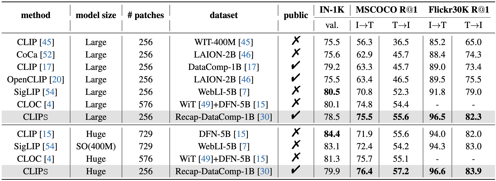
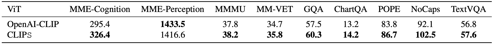

# **CLIPS**

**Official implementation of the paper "_CLIPS: An Enhanced CLIP Framework for Learning with Synthetic Captions_".**

---

## **Authors**

- [Yanqing Liu](https://yanqing0327.github.io/Yanqing.github.io/)<sup>1</sup>, [Xianhang Li](https://xhl-video.github.io/xianhangli/)<sup>1</sup>, [Zeyu Wang](https://zw615.github.io/)<sup>1</sup>,  [Bingchen Zhao](https://bzhao.me/)<sup>2</sup>, [Cihang Xie](https://cihangxie.github.io/)<sup>1</sup>  

<sup>1</sup>UC Santa Cruz, <sup>2</sup>University of Edinburgh  

---

## **Links**
- [📄 Paper (arXiv)](https://arxiv.org/abs/2406.08478)  
- [🤗 Pretrained Model on HuggingFace](https://huggingface.co/UCSC-VLAA/ViT-L-14-CLIPS-Recap-DataComp-1B)  
- [🌐 Project Page](https://ucsc-vlaa.github.io/CLIPS/)

---

## **Proposed Method**


Previous works show that noisy, web-crawled image-text pairs may limit vision-language pretraining like CLIP and propose learning with synthetic captions as a promising alternative. Our work continues this effort, introducing two simple yet effective designs to better leverage richly described synthetic captions:

1. By observing a strong inverse effect with synthetic captions, we use only **partial synthetic captions** to feed the text encoder, achieving significantly better performance.
2. We incorporate an **autoregressive captioner** that mimics the recaptioning process, predicting full-length synthetic captions conditioned on the image and original web-crawled captions.

Our method achieves **state-of-the-art (SOTA)** results in zero-shot image-text retrieval on MSCOCO and Flickr30K, while enhancing the visual capability of LLaVA.

---

## **Key Results**

### **Inverse Effect with Synthetic Captions**


Visualization of four different token reduction strategies. These strategies can improve the model's learning efficiency on synthetic captions to varying degrees. Among these strategies, the sub-caption and block mask perform best.

---

### **Zero-Shot Cross-Modal Retrieval**


Our method consistently achieves superior performance across all benchmarks and model sizes, yielding significant improvements over the baselines.

---

### **Comparison with State-of-the-Art Methods**


With increased computational resources and scaling, our best model further achieves 76.4% and 96.6% R@1 text retrieval performance on MSCOCO and Flickr30K respectively, and 57.2% and 83.9% R@1 image retrieval performance on the same datasets, setting new state-of-the-art (SOTA) results.

---

### **CLIPS in LLaVA**


Replacing OpenAI-CLIP with **CLIPS** significantly boosts LLaVA's performance across various benchmarks.

---

## **Model Zoo**

| Model          | Link                                                                                     |
|----------------|------------------------------------------------------------------------------------------|
| CLIPS-Large-14 | [🤗 HuggingFace Model](https://huggingface.co/UCSC-VLAA/ViT-L-14-CLIPS-Recap-DataComp-1B) |
| CLIPS-Huge-14  | Coming Soon...                                                                          |

## **Model Usage**
### **Environment**
Install dependencies:
```
pip3 install -r requirements.txt
```
### **With OpenCLIP**
```python
import torch
import torch.nn.functional as F
from urllib.request import urlopen
from PIL import Image
from open_clip import create_model_from_pretrained, get_tokenizer

model, preprocess = create_model_from_pretrained('hf-hub:UCSC-VLAA/ViT-L-14-CLIPS-Recap-DataComp-1B')
tokenizer = get_tokenizer('hf-hub:UCSC-VLAA/ViT-L-14-CLIPS-Recap-DataComp-1B')

image = Image.open(urlopen(
    'https://huggingface.co/datasets/huggingface/documentation-images/resolve/main/beignets-task-guide.png'
))
image = preprocess(image).unsqueeze(0)

text = tokenizer(["a diagram", "a dog", "a cat", "a beignet"], context_length=model.context_length)

with torch.no_grad(), torch.cuda.amp.autocast():
    image_features = model.encode_image(image)
    text_features = model.encode_text(text)
    image_features = F.normalize(image_features, dim=-1)
    text_features = F.normalize(text_features, dim=-1)

    text_probs = (100.0 * image_features @ text_features.T).softmax(dim=-1)

print("Label probs:", text_probs)  # prints: [[0., 0., 0., 1.0]]
```
#### Note: Due to differences in the default epsilon values for LayerNorm initialization between JAX and PyTorch, we made some modifications in open_clip/transformer.py to align the model's behavior.
## Acknowledgement

This pytorch repo is built on [OpenCLIP](https://github.com/mlfoundations/open_clip). 
Many thanks to the awesome works from the open-source community!

We would like to thank TPU Research Cloud (TRC) program, Google Cloud Research Credits program, and AWS Cloud Credit for Research program for supporting our computing needs.
<!-- ---

## **Citation**

If you use our work, please cite it:

```bibtex
@article{liu2024clips,
  title={CLIPS: An Enhanced CLIP Framework for Learning with Synthetic Captions},
  author={Liu, Yanqing and Li, Xianhang and Wang, Zeyu and Zhao, Bingchen and Xie, Cihang},
  journal={arXiv preprint arXiv:2406.08478},
  year={2024}
} -->
